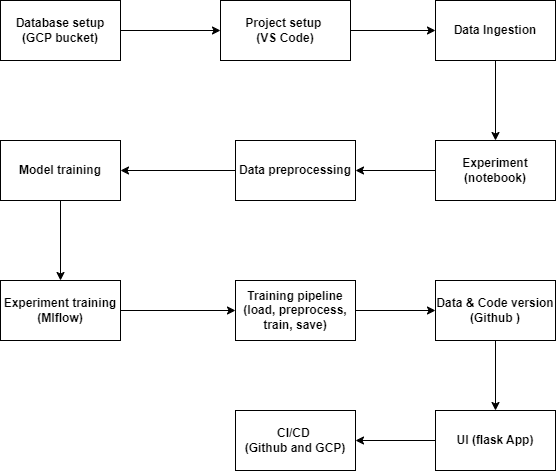
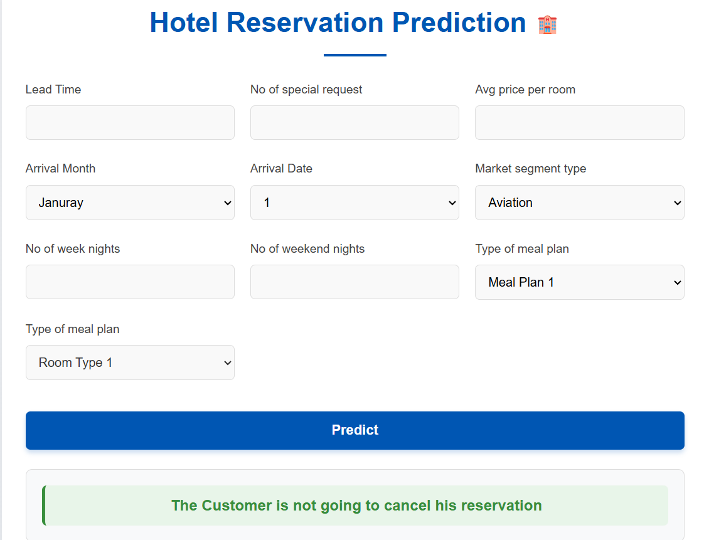

# Hotel reservation🕋 MLOps

An end-to-end implementation to predict whether a customer will honor or default his reservation using `GCP bucket` for storage, `mlflow` for experiment tracking of multiple models (ranfom forest, xgboost, lightgbm, adaboost, SVM, linearReg, etc), `github` for code and data versioning, `flask` for the app UI, `Jenkins` and `docker` for the CI/CD pipeline.

**Use cases:**
-   Revenue management
-   Target marketing
-   Fraud detection

## Project flow

**Design flow**

**Initial flask app**

**Successful deployment of the flask app on GC Run with Jenkins** 

## Key features

-   💾Data ingestion into `GCP bucket`.
-   ⌛Data preprocessing and model training. Multiple models were trained and the most performant were `random forest`, `xgboost`,and `lightgbm`. However due to model size, `lightgbm` was chosen for deployment as the performance gap was not huge.
-   📈Experiment tracking with `mlflow`.
-   📽️ Custom Logger for better maintenability.
-   📲 `Jenkins` and `Google Cloud , Registry and Run` for CI/CD where DinD (docker in docker) is applied to containerize both Jenkins and the code base. 
-   🌐 `flask` for User application.

**Testing deployed flask app**

